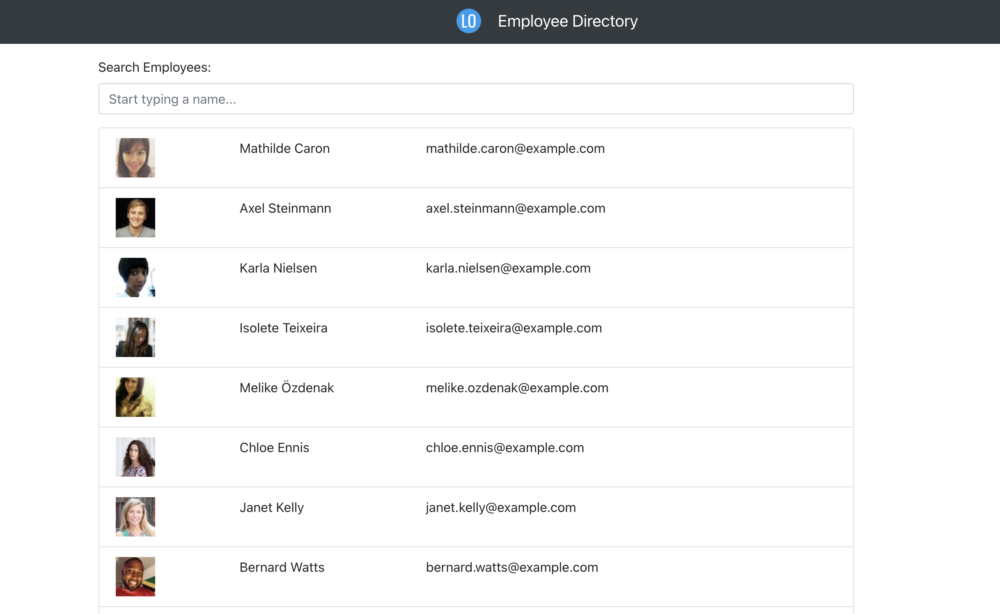

# employee-directory

## Description

This is a homework assignment for the University of Denver Web Development Boot Camp!  

For this project, I was to create (from scratch) an Employee Directory application using React.js! The application populates random employee information using the RandomUser API, and dynamically renders the directory using React. It then allows the user to search for employees by name, live updating the employee list with each new keystroke of their search query. Finally, the user is also able to sort the list of employees in ascending or descending order based on their name. 

## Deployment

The code (and associated assets) are hosted right here in this GitHub repository, and it's all live on the web thanks to GitHub Pages. If you would like to check it out, you can view the site at the link below:

<a href="https://lukeoxner.github.io/employee-directory/" target="_blank"><b>employee-directory Live App</b></a>
  

## Credits

This project was made using HTML, CSS, Javascript, and React.JS.
